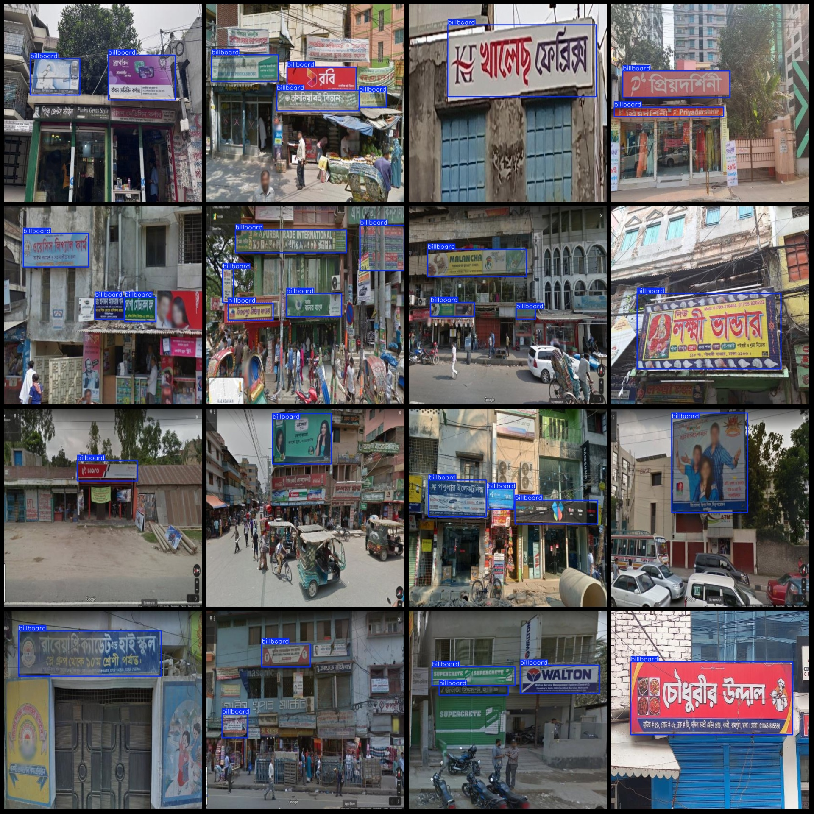
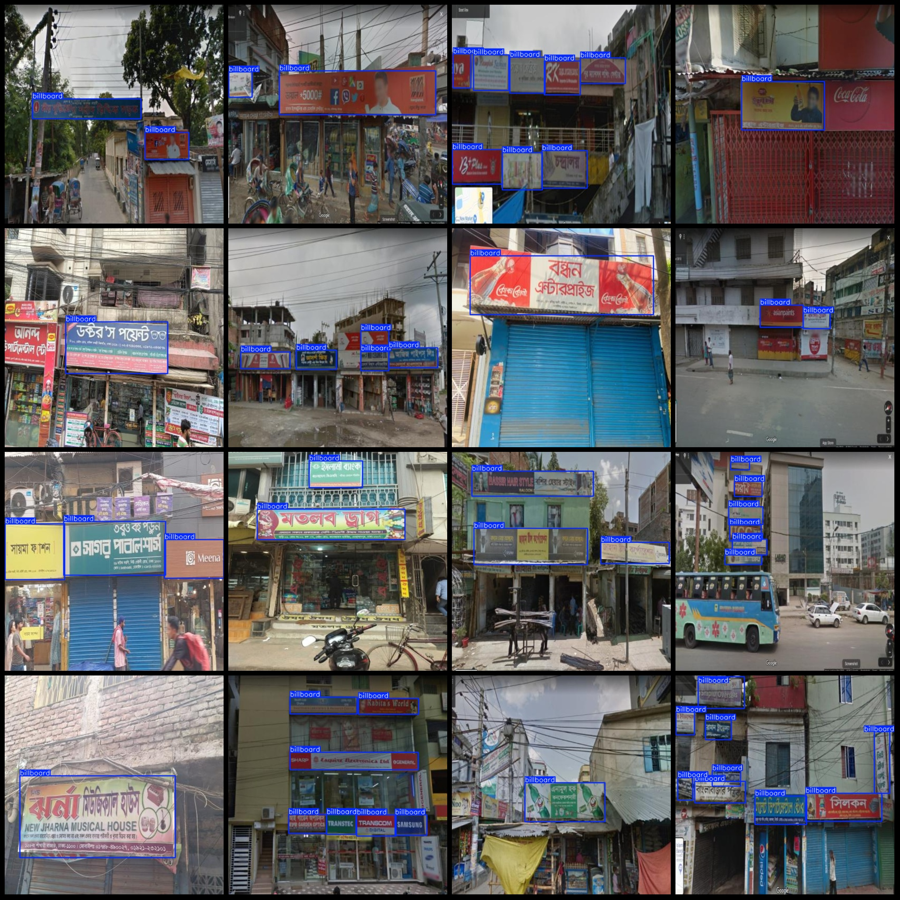

# Smart City Advertisement Signage Streetside Sidewalk Signage Dataset VOC+YOLO Format, 1238 Images in 1 Category

**Note:** All advertisement signs in the dataset are in English or foreign languages, with no Chinese signs.

**Dataset Format:** Pascal VOC format + YOLO format (excluding split paths' txt files, only containing jpg images and corresponding VOC format xml files and YOLO format txt files)

**Number of Images (jpg Files):** 1238

**Number of Annotations (xml Files):** 1238

**Number of Annotations (txt Files):** 1238

**Number of Annotated Categories:** 1

**Annotated Category Name:** "billboard"

**Number of Boxes for Each Category:**
- Billboard boxes count = 2644
- Total boxes count = 2644

**Image Resolution:** 640x640

**Annotation Tool:** labelImg

**Annotation Rules:** Draw boxes around the category

**Important Notice:** The dataset does not include training/validation/test splits; you need to manually divide them.

**Special Remark:** This dataset does not guarantee the accuracy of models trained on it or any weight files.

**Image Preview:**

**Annotation Example:**

## Images

Here is a pay link on Stripe ( https://buy.stripe.com/3cs8yP7sY87d0vu9AB ). Please contact me lonlonago@foxmail.com after funding $89, and I will send you a complete data files , thank you!

